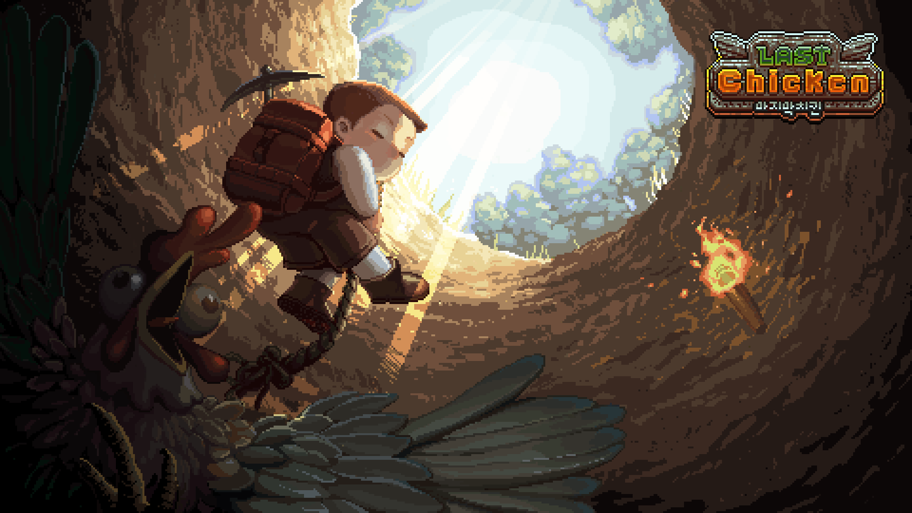
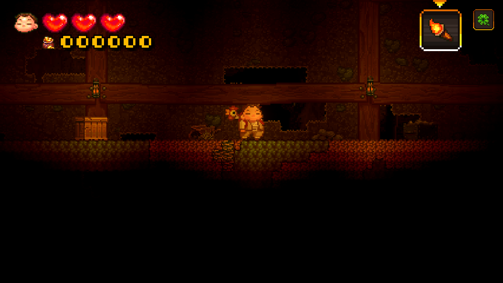
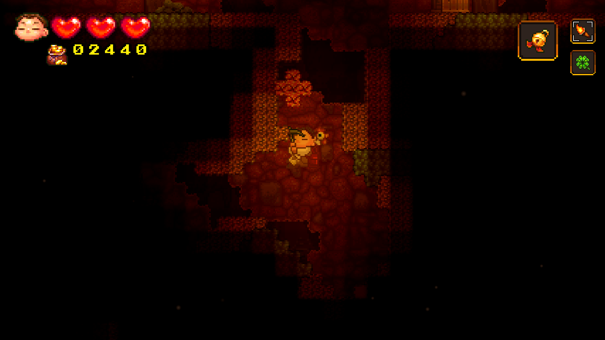
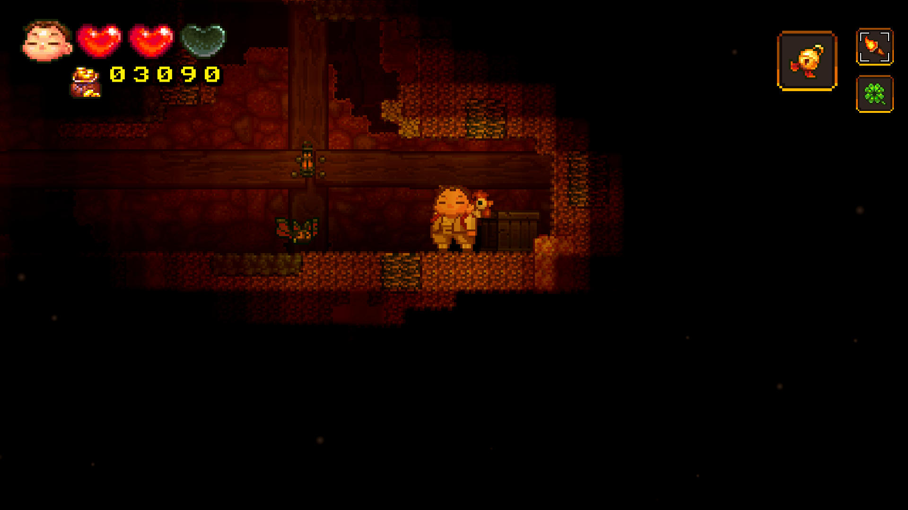
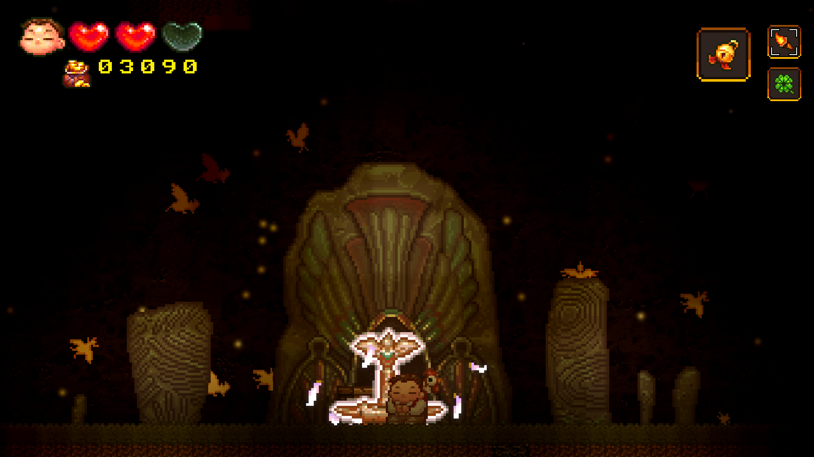
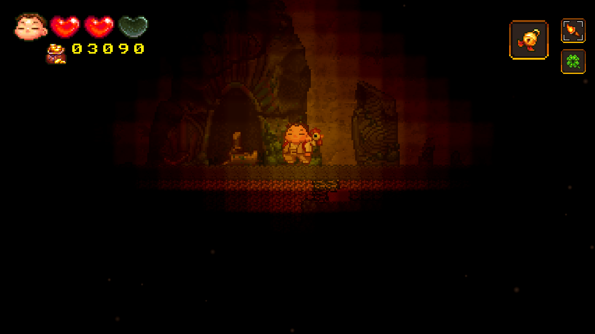
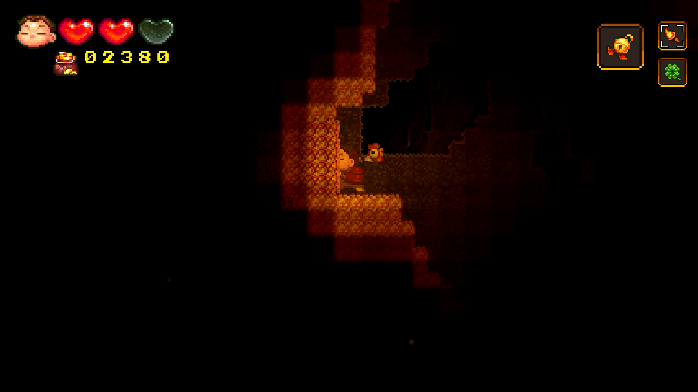
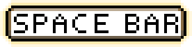

# The_Last_Chicken

당신은 과연 치킨을 지킬 수 있을것인가?

<h3>조작</h3>
<table border="0">
	<tr>
	    <td>
		    <table border="0">
			<tr>
	    			<td>이동</td>
	    			<td>점프</td>
				<td>낙하</td>
			</tr>
			<tr>
	    			<td></td>
	    			<td></td>
				<td></td>
			</tr>
			<tr>
	    			<td>아이템 교체  </td>
	    			<td>아이템 버리기</td>
				<td>아이템 사용  </td>			
			</tr>
  			<tr>
	    			<td></td>
	    			<td></td>
				<td></td>
			</tr>
			<tr>
	    			<td>공격  </td>
	    			<td>줍기 & 잡기</td>
				<td></td>			
			</tr>
  			<tr>
	    			<td></td>
	    			<td></td>
				<td> </td>
			</tr>
    		    </table>
	    </td>
	</tr>
</table>
